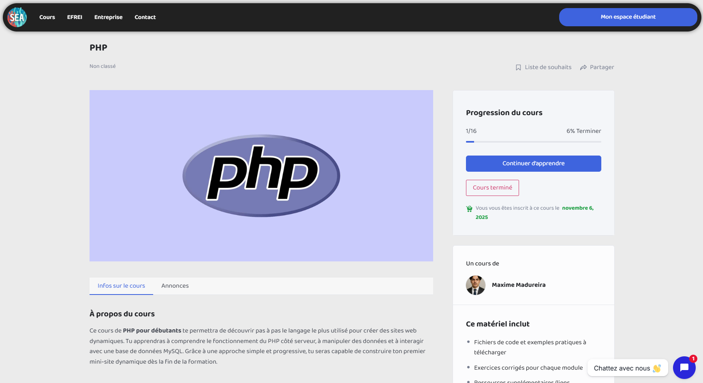
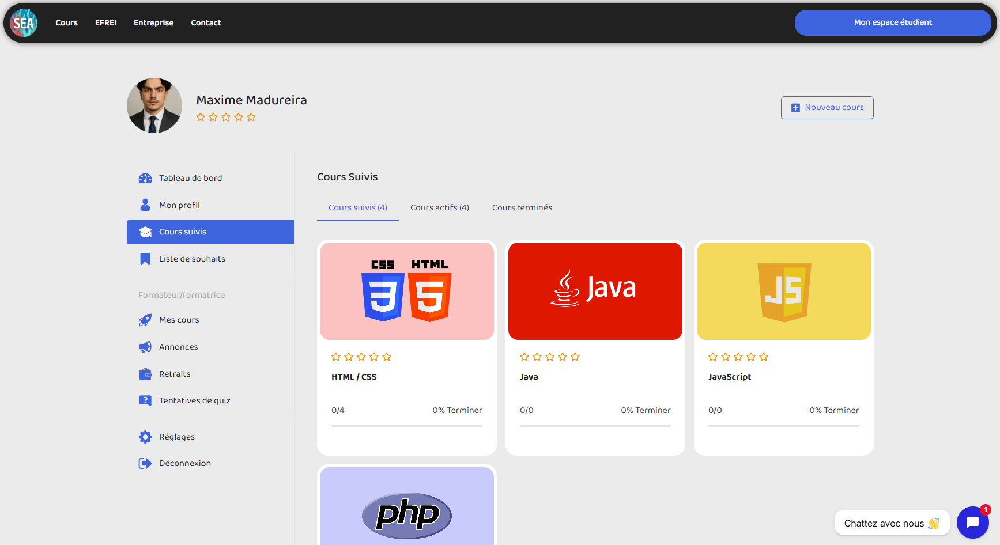
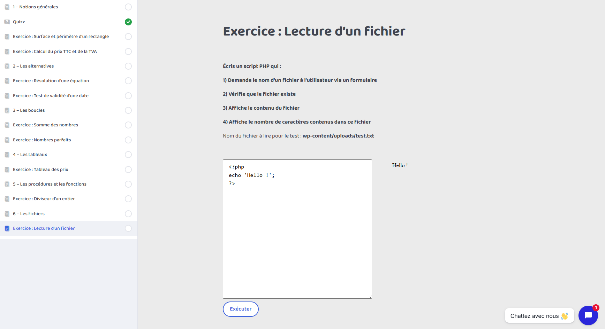

# SEA Learning

Plateforme e-learning développée avec WordPress, permettant l’apprentissage du code à travers des leçons interactives, des exercices pratiques et des quiz d’évaluation.

🔗 **Lien du site :** https://finalmb.great-site.net  
🔗 **Lien de la présentation :** pdf 

 

## 🎯 Objectif du projet

SEA Learning est une plateforme de formation en ligne conçue pour proposer des cours d’informatique structurés et progressifs.  

L’objectif est de fournir :
- Un parcours pédagogique clair
- Des exercices pratiques directement intégrés à la plateforme
- Un suivi personnalisé de la progression des utilisateurs

 

## 🚀 Fonctionnalités principales

### 📚 Cours structurés
- Leçons organisées par modules
- Exercices pratiques intégrés
- Quiz d’évaluation pour valider les acquis

### 📊 Tableau de bord utilisateur
- Suivi de progression
- Visualisation des cours complétés
- Accès rapide aux modules en cours

 

### 💻 Sandbox de codage
- Plugin personnalisé de type "Sandbox"
- Environnement permettant d’écrire et tester du code directement sur la plateforme
- Validation dynamique des exercices

 

## 🛠 Technologies utilisées

- **WordPress**
- **PHP**
- **CSS**
- **Plugins personnalisés**
- **Base de données MySQL**

 

## 👤 Gestion des utilisateurs

- Création de compte
- Authentification sécurisée
- Suivi individualisé de la progression
- Gestion des rôles (administrateur / utilisateur)

 

## 📬 Contact

📧 maxime.madureira@gmail.com  
🔗 https://www.linkedin.com/in/maxime-madureira
